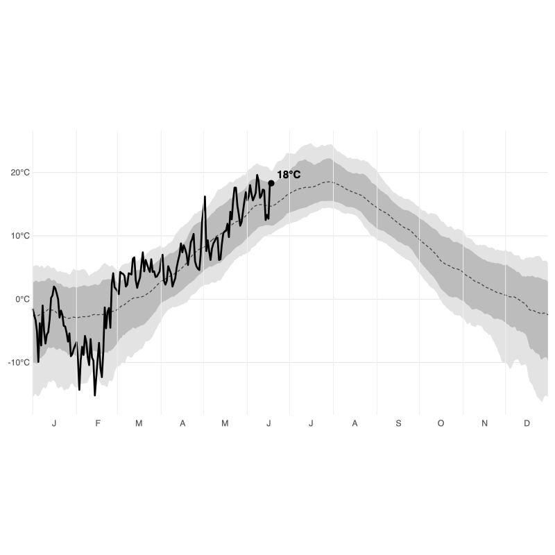

# TRMNL Climate Monitor

A [TRMNL](https://usetrmnl.com) private plugin that plots this year's daily
temperature against the 1991–2020 climate normal for any location — in the
style of the [Reuters automated climate monitor](https://www.reuters.com/graphics/CLIMATE-AUTOMATED/MONITOR/akpeykqqapr/)
/ Climate Reanalyzer charts.



- **Light grey band** — full record range (daily min/max over the normal window)
- **Dark grey band** — 10th–90th percentile (a "typical" day)
- **Dashed line** — the normal (mean) for each day of year
- **Bold black line** — this year so far, with today's value marked

## How it works

1. `build_data.py` pulls daily mean 2 m temperature from the free
   [Open-Meteo](https://open-meteo.com) Archive API (no key required),
   computes the climatology, **renders the chart to SVG**, and writes a compact
   `data.json`.
2. A daily GitHub Action runs the script and commits `data.json`.
3. TRMNL polls the raw `data.json` URL and the Liquid templates embed the SVG.

All the maths and drawing happen in the build step, so the templates stay
trivial and there's no server to run.

## Setup

### 1. Configure your location

Edit the `env:` block in [`.github/workflows/update.yml`](.github/workflows/update.yml):

```yaml
LAT: "59.3293"        # your latitude
LON: "18.0686"        # your longitude
LOCATION: "Stockholm" # label shown on the device
UNITS: "celsius"      # or "fahrenheit"
```

Find coordinates at e.g. https://www.latlong.net. The same variables work
locally: `LAT=51.5074 LON=-0.1278 LOCATION=London python3 build_data.py`.

### 2. Push to GitHub and enable the Action

```bash
git init && git add . && git commit -m "TRMNL climate monitor"
gh repo create trmnl-climate-monitor --public --source=. --push
```

In the repo: **Settings → Actions → General → Workflow permissions →
Read and write**. Then run the workflow once manually (**Actions → Update
climate data → Run workflow**) so `data.json` is generated.

Your polling URL is:

```
https://raw.githubusercontent.com/<user>/trmnl-climate-monitor/main/data.json
```

### 3. Create the TRMNL private plugin

In the TRMNL web UI: **Plugins → Private Plugin → Create**.

- **Strategy:** Polling
- **Polling URL:** the raw `data.json` URL above
- **Refresh:** every 12–24 h (the data updates once a day)
- **Markup:** paste the contents of the files in [`trmnl/`](trmnl/) into the
  matching layout tabs:
  - `full.liquid` → Full
  - `half_horizontal.liquid` → Half (horizontal)
  - `half_vertical.liquid` → Half (vertical)
  - `quadrant.liquid` → Quadrant

Save, add it to a playlist, and you're done.

## JSON fields

| field | meaning |
|-------|---------|
| `location`, `units`, `year`, `updated` | labels |
| `current_temp`, `normal_temp`, `anomaly`, `anomaly_str` | today vs normal |
| `normal_window` | e.g. `1991–2020` |
| `svg_full`, `svg_compact` | pre-rendered charts |

## Notes & limits

- Open-Meteo's archive lags real time by a few days; the script tops up the
  last ~10 days (including today) from the forecast endpoint, so the tip of the
  line is a forecast-grade estimate, not yet reanalysis.
- This tracks a **point location**, not the global mean the Reuters monitor
  shows. For a regional average, average several `build_data.py` runs or extend
  the script to query multiple points.
- Open-Meteo is free for non-commercial use; this stays well within limits
  (two requests/day).
